# Architecture and Workflow Diagrams

## System Architecture

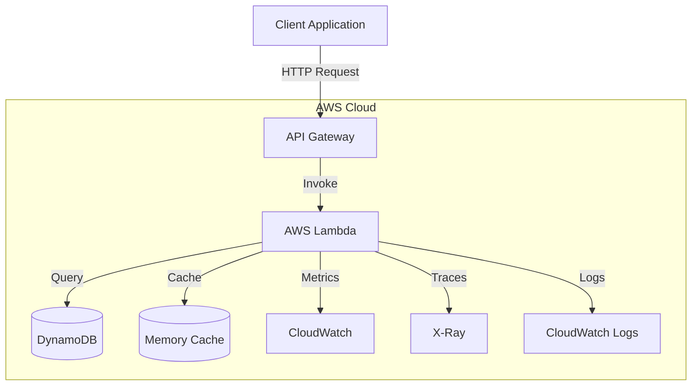

## Request Flow

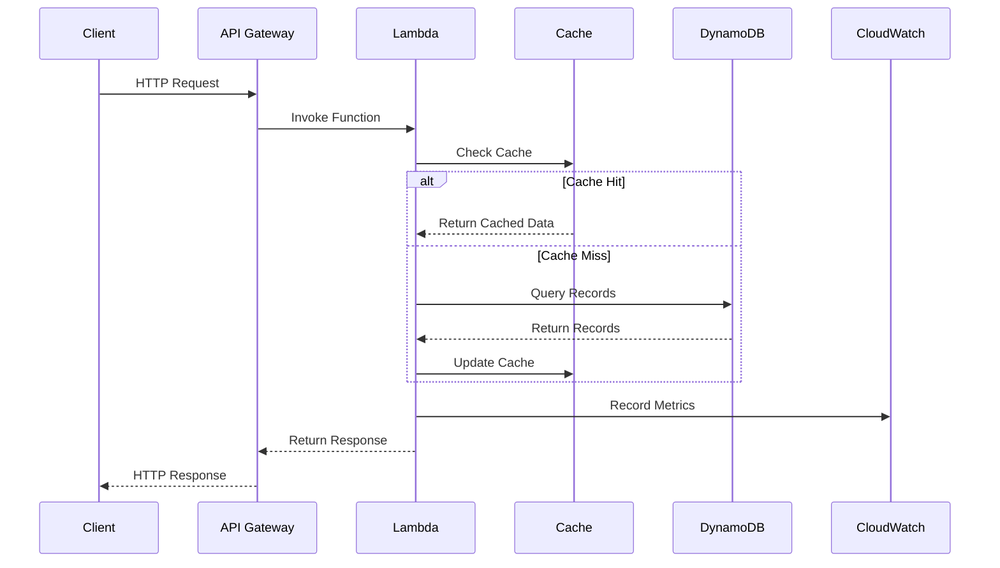

## Monitoring Architecture

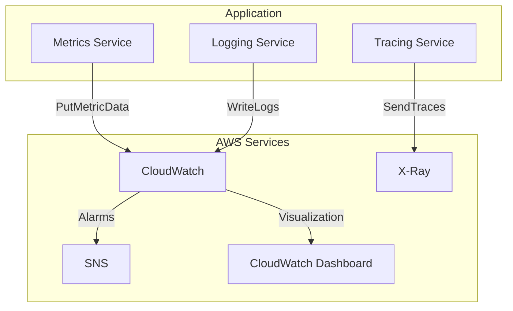

## Testing Architecture

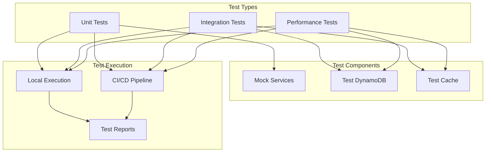

## Backup and Recovery Flow

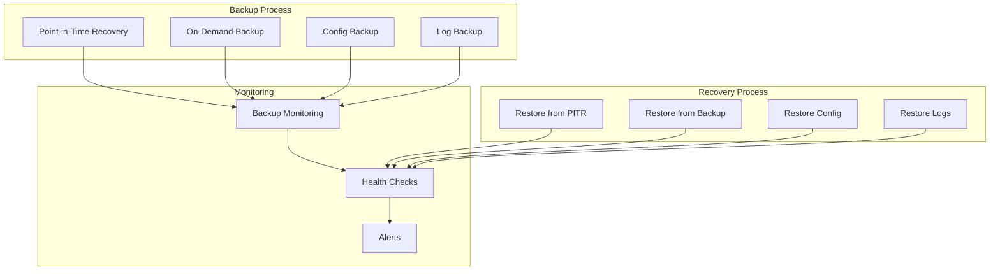

## Security Architecture

```mermaid
graph TB
    subgraph Authentication
        APIKey[API Key Auth]
        IAM[IAM Auth]
        Cognito[Cognito Auth]
    end

    subgraph Authorization
        Policies[IAM Policies]
        Roles[IAM Roles]
        Permissions[Resource Permissions]
    end

    subgraph Data Protection
        Encryption[Data Encryption]
        SSL[SSL/TLS]
        Headers[Security Headers]
    end

    subgraph Monitoring
        CloudTrail[CloudTrail]
        GuardDuty[GuardDuty]
        WAF[WAF]
    end

    APIKey --> Policies
    IAM --> Policies
    Cognito --> Policies
    Policies --> Roles
    Roles --> Permissions

    Encryption --> Data Protection
    SSL --> Data Protection
    Headers --> Data Protection

    CloudTrail --> Monitoring
    GuardDuty --> Monitoring
    WAF --> Monitoring
```

## Development Workflow

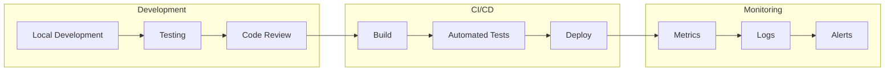

## Cache Architecture

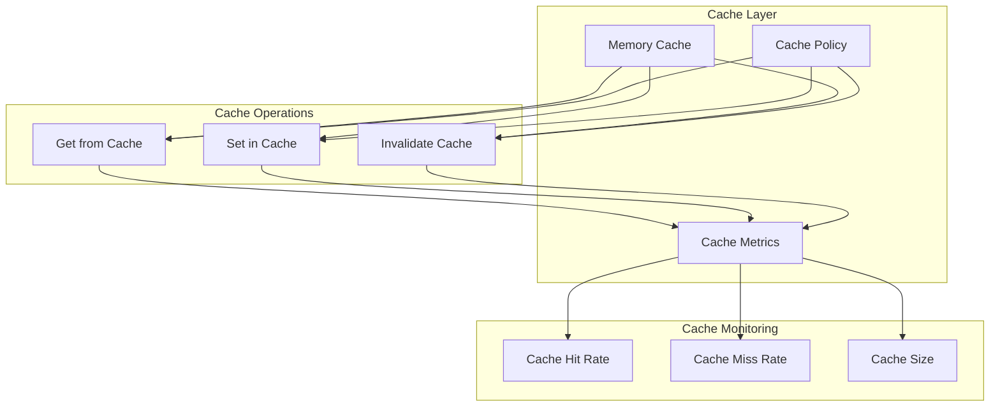

## Error Handling Flow

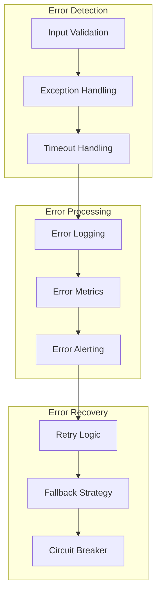

## Deployment Architecture

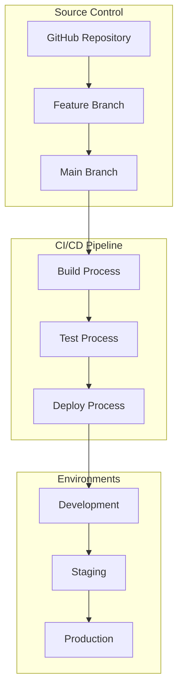

## Query Request Handling

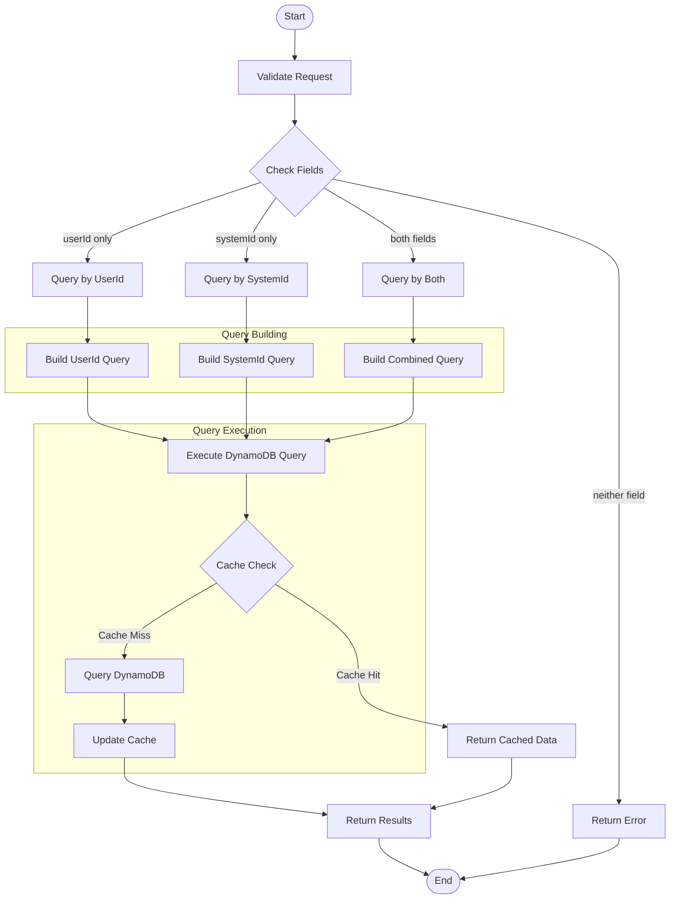

## Query Request Sequence

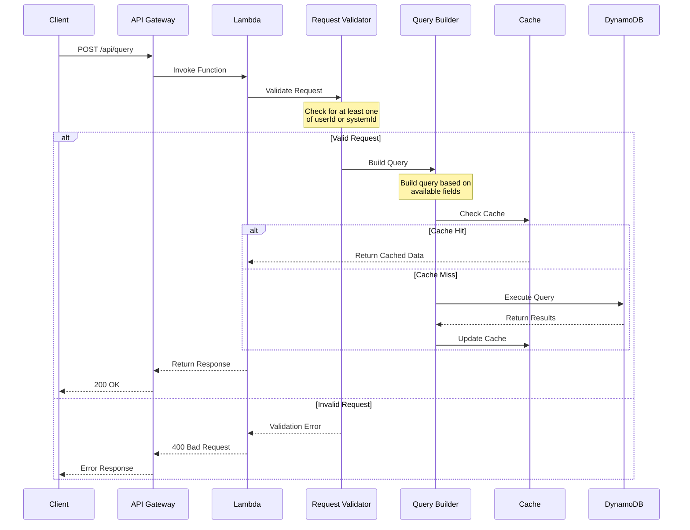

## Query Field Combinations

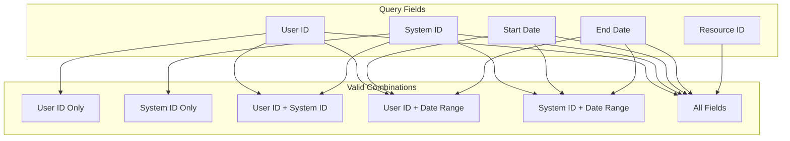