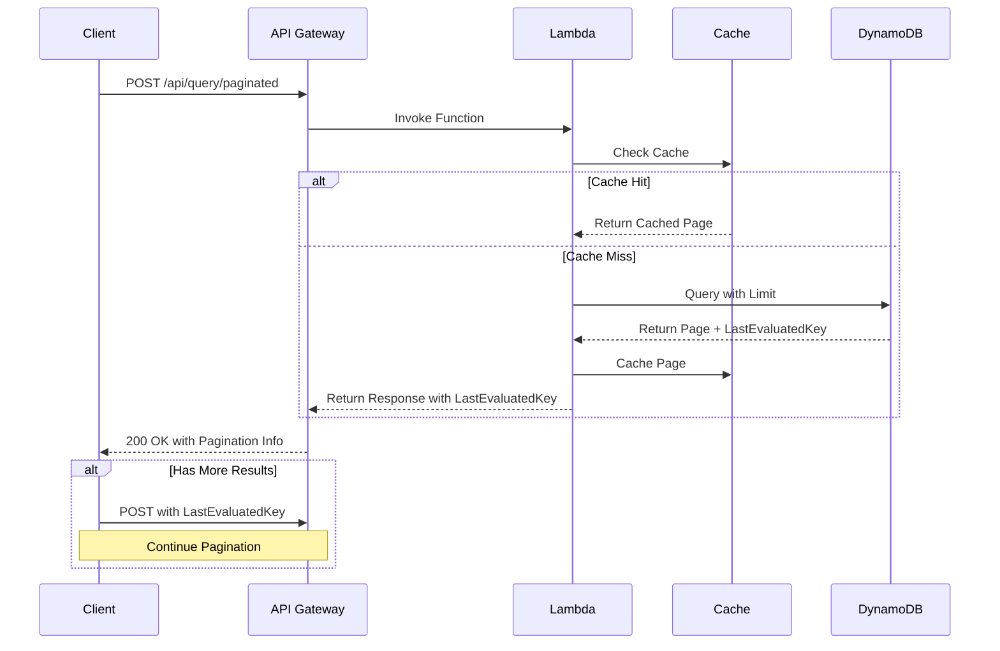
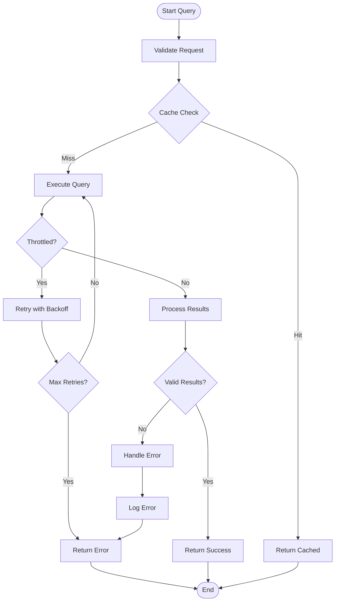

# Pagination Handling

## Overview

The DynamoDB Processor implements pagination to handle large result sets and prevent hitting DynamoDB's 1MB data limit. This is achieved using DynamoDB's `LastEvaluatedKey` for pagination and result concatenation.

## Pagination Flow



## Error Handling Flow



## Pagination Implementation

```csharp
public class PaginatedQueryResponse
{
    public List<Dictionary<string, AttributeValue>> Items { get; set; }
    public Dictionary<string, AttributeValue> LastEvaluatedKey { get; set; }
    public bool HasMoreResults { get; set; }
    public int TotalItems { get; set; }
}

public class QueryExecutor
{
    private readonly IAmazonDynamoDB _dynamoDB;
    private readonly IMemoryCache _cache;
    private readonly IMetricsService _metrics;
    private readonly ILogger<QueryExecutor> _logger;
    private const int MaxPageSize = 1000; // Maximum items per page

    public async Task<PaginatedQueryResponse> ExecuteQueryAsync(
        QueryRequest request,
        Dictionary<string, AttributeValue> lastEvaluatedKey = null)
    {
        var cacheKey = GenerateCacheKey(request, lastEvaluatedKey);
        
        if (_cache.TryGetValue(cacheKey, out PaginatedQueryResponse cachedResponse))
        {
            _metrics.RecordCountAsync("CacheHit", 1);
            return cachedResponse;
        }

        try
        {
            var queryRequest = _queryBuilder.BuildQuery(request);
            queryRequest.Limit = MaxPageSize;
            
            if (lastEvaluatedKey != null)
            {
                queryRequest.ExclusiveStartKey = lastEvaluatedKey;
            }

            var response = await _dynamoDB.QueryAsync(queryRequest);
            
            var paginatedResponse = new PaginatedQueryResponse
            {
                Items = response.Items,
                LastEvaluatedKey = response.LastEvaluatedKey,
                HasMoreResults = response.LastEvaluatedKey != null,
                TotalItems = response.Items.Count
            };

            _cache.Set(cacheKey, paginatedResponse, TimeSpan.FromMinutes(5));
            _metrics.RecordCountAsync("CacheMiss", 1);
            
            return paginatedResponse;
        }
        catch (Exception ex)
        {
            _logger.LogError(ex, "Error executing query");
            _metrics.RecordCountAsync("QueryError", 1);
            throw;
        }
    }

    public async Task<PaginatedQueryResponse> ExecuteQueryWithPaginationAsync(
        QueryRequest request,
        int maxItems = 10000)
    {
        var allItems = new List<Dictionary<string, AttributeValue>>();
        Dictionary<string, AttributeValue> lastEvaluatedKey = null;
        int totalItems = 0;

        do
        {
            var response = await ExecuteQueryAsync(request, lastEvaluatedKey);
            allItems.AddRange(response.Items);
            lastEvaluatedKey = response.LastEvaluatedKey;
            totalItems += response.Items.Count;

            // Check if we've reached the maximum items limit
            if (totalItems >= maxItems)
            {
                break;
            }

            // Add a small delay to prevent throttling
            if (lastEvaluatedKey != null)
            {
                await Task.Delay(100);
            }
        } while (lastEvaluatedKey != null);

        return new PaginatedQueryResponse
        {
            Items = allItems,
            LastEvaluatedKey = lastEvaluatedKey,
            HasMoreResults = lastEvaluatedKey != null,
            TotalItems = totalItems
        };
    }

    private string GenerateCacheKey(
        QueryRequest request,
        Dictionary<string, AttributeValue> lastEvaluatedKey)
    {
        var keyParts = new List<string>
        {
            request.UserId ?? "null",
            request.SystemId ?? "null",
            request.StartDate?.ToString("o") ?? "null",
            request.EndDate?.ToString("o") ?? "null",
            request.ResourceId ?? "null"
        };

        if (lastEvaluatedKey != null)
        {
            foreach (var key in lastEvaluatedKey.OrderBy(k => k.Key))
            {
                keyParts.Add($"{key.Key}:{key.Value.S ?? key.Value.N}");
            }
        }

        return string.Join("|", keyParts);
    }
}
```

## API Controller Implementation

```csharp
[ApiController]
[Route("api/[controller]")]
public class QueryController : ControllerBase
{
    private readonly IQueryExecutor _queryExecutor;
    private readonly ILogger<QueryController> _logger;

    [HttpPost("paginated")]
    public async Task<IActionResult> QueryPaginated(
        [FromBody] QueryRequest request,
        [FromQuery] int? pageSize = 1000,
        [FromQuery] string lastEvaluatedKey = null)
    {
        try
        {
            Dictionary<string, AttributeValue> lastKey = null;
            if (!string.IsNullOrEmpty(lastEvaluatedKey))
            {
                lastKey = JsonSerializer.Deserialize<Dictionary<string, AttributeValue>>(
                    lastEvaluatedKey);
            }

            var response = await _queryExecutor.ExecuteQueryAsync(request, lastKey);

            return Ok(new
            {
                Items = response.Items,
                LastEvaluatedKey = response.LastEvaluatedKey != null
                    ? JsonSerializer.Serialize(response.LastEvaluatedKey)
                    : null,
                HasMoreResults = response.HasMoreResults,
                TotalItems = response.TotalItems
            });
        }
        catch (Exception ex)
        {
            _logger.LogError(ex, "Error executing paginated query");
            return StatusCode(500, "Error executing query");
        }
    }

    [HttpPost("all")]
    public async Task<IActionResult> QueryAll(
        [FromBody] QueryRequest request,
        [FromQuery] int? maxItems = 10000)
    {
        try
        {
            var response = await _queryExecutor.ExecuteQueryWithPaginationAsync(
                request,
                maxItems ?? 10000);

            return Ok(new
            {
                Items = response.Items,
                HasMoreResults = response.HasMoreResults,
                TotalItems = response.TotalItems
            });
        }
        catch (Exception ex)
        {
            _logger.LogError(ex, "Error executing query with pagination");
            return StatusCode(500, "Error executing query");
        }
    }
}
```

## Usage Examples

### 1. Basic Pagination

```http
POST /api/query/paginated
Content-Type: application/json

{
  "userId": "user123",
  "systemId": "system456",
  "startDate": "2024-01-01T00:00:00Z",
  "endDate": "2024-01-31T23:59:59Z"
}
```

Response:
```json
{
  "items": [...],
  "lastEvaluatedKey": "eyJ1c2VySWQiOiJ1c2VyMTIzIiwic3lzdGVtSWQiOiJzeXN0ZW00NTYiLCJ0aW1lc3RhbXAiOiIyMDI0LTAxLTAxVDAwOjAwOjAwWiJ9",
  "hasMoreResults": true,
  "totalItems": 1000
}
```

### 2. Continue Pagination

```http
POST /api/query/paginated?lastEvaluatedKey=eyJ1c2VySWQiOiJ1c2VyMTIzIiwic3lzdGVtSWQiOiJzeXN0ZW00NTYiLCJ0aW1lc3RhbXAiOiIyMDI0LTAxLTAxVDAwOjAwOjAwWiJ9
Content-Type: application/json

{
  "userId": "user123",
  "systemId": "system456",
  "startDate": "2024-01-01T00:00:00Z",
  "endDate": "2024-01-31T23:59:59Z"
}
```

### 3. Get All Results

```http
POST /api/query/all?maxItems=5000
Content-Type: application/json

{
  "userId": "user123",
  "systemId": "system456",
  "startDate": "2024-01-01T00:00:00Z",
  "endDate": "2024-01-31T23:59:59Z"
}
```

## Performance Considerations

1. **Page Size**
   - Default page size of 1000 items
   - Configurable through API parameters
   - Balances between response time and data transfer

2. **Caching Strategy**
   - Caches individual pages
   - Uses composite cache keys including pagination state
   - Implements cache invalidation

3. **Throttling Prevention**
   - Adds small delays between paginated requests
   - Implements exponential backoff for retries
   - Monitors DynamoDB consumed capacity

4. **Memory Management**
   - Streams large result sets
   - Implements result set size limits
   - Handles memory efficiently

## Best Practices

1. **Pagination Implementation**
   - Use consistent page sizes
   - Handle LastEvaluatedKey properly
   - Implement proper error handling
   - Use parallel fetching when appropriate
   - Implement adaptive page sizes

2. **Performance Optimization**
   - Cache paginated results
   - Implement proper delays
   - Monitor performance metrics
   - Use compression for large results
   - Implement prefetching strategies

3. **Error Handling**
   - Handle DynamoDB throttling
   - Implement retry logic
   - Provide clear error messages
   - Log detailed error information
   - Implement circuit breakers

4. **Monitoring**
   - Track pagination metrics
   - Monitor cache performance
   - Alert on issues
   - Track error rates
   - Monitor throughput

5. **Resource Management**
   - Implement proper cleanup
   - Monitor memory usage
   - Handle large result sets
   - Implement timeouts
   - Use connection pooling

## Advanced Error Handling

```csharp
public class PaginationErrorHandler
{
    private readonly ILogger<PaginationErrorHandler> _logger;
    private readonly IMetricsService _metrics;
    private const int MaxRetries = 3;
    private const int BaseDelayMs = 100;

    public async Task<PaginatedQueryResponse> ExecuteWithRetryAsync(
        Func<Task<PaginatedQueryResponse>> queryFunc)
    {
        int retryCount = 0;
        while (true)
        {
            try
            {
                return await queryFunc();
            }
            catch (ProvisionedThroughputExceededException ex)
            {
                retryCount++;
                if (retryCount >= MaxRetries)
                {
                    _logger.LogError(ex, "Max retries exceeded for throttled query");
                    _metrics.RecordCountAsync("QueryThrottledMaxRetries", 1);
                    throw;
                }

                var delay = BaseDelayMs * Math.Pow(2, retryCount - 1);
                _logger.LogWarning(
                    "Query throttled, retrying in {Delay}ms (attempt {RetryCount}/{MaxRetries})",
                    delay, retryCount, MaxRetries);
                await Task.Delay((int)delay);
            }
            catch (ResourceNotFoundException ex)
            {
                _logger.LogError(ex, "Table or index not found");
                _metrics.RecordCountAsync("QueryResourceNotFound", 1);
                throw;
            }
            catch (ValidationException ex)
            {
                _logger.LogError(ex, "Invalid query parameters");
                _metrics.RecordCountAsync("QueryValidationError", 1);
                throw;
            }
            catch (Exception ex)
            {
                _logger.LogError(ex, "Unexpected error during query execution");
                _metrics.RecordCountAsync("QueryUnexpectedError", 1);
                throw;
            }
        }
    }
}
```

## Performance Optimization

```csharp
public class PaginationOptimizer
{
    private readonly IMemoryCache _cache;
    private readonly IMetricsService _metrics;
    private readonly ILogger<PaginationOptimizer> _logger;

    public async Task<PaginatedQueryResponse> OptimizeQueryAsync(
        QueryRequest request,
        Dictionary<string, AttributeValue> lastEvaluatedKey)
    {
        // 1. Parallel Page Prefetching
        if (ShouldPrefetchPages(request))
        {
            return await PrefetchNextPagesAsync(request, lastEvaluatedKey);
        }

        // 2. Adaptive Page Size
        var pageSize = CalculateOptimalPageSize(request);
        
        // 3. Result Compression
        var response = await ExecuteQueryWithCompressionAsync(request, pageSize, lastEvaluatedKey);
        
        // 4. Cache Optimization
        await OptimizeCacheAsync(request, response);
        
        return response;
    }

    private bool ShouldPrefetchPages(QueryRequest request)
    {
        // Analyze query patterns and user behavior
        var queryPattern = AnalyzeQueryPattern(request);
        return queryPattern.SuggestPrefetch;
    }

    private async Task<PaginatedQueryResponse> PrefetchNextPagesAsync(
        QueryRequest request,
        Dictionary<string, AttributeValue> lastEvaluatedKey)
    {
        var tasks = new List<Task<PaginatedQueryResponse>>();
        var nextKeys = PredictNextKeys(request, lastEvaluatedKey);

        foreach (var key in nextKeys)
        {
            tasks.Add(ExecuteQueryAsync(request, key));
        }

        var results = await Task.WhenAll(tasks);
        return CombineResults(results);
    }

    private int CalculateOptimalPageSize(QueryRequest request)
    {
        // Consider factors like:
        // - Average item size
        // - Network latency
        // - User behavior patterns
        // - Available memory
        return Math.Min(1000, GetOptimalSize(request));
    }

    private async Task OptimizeCacheAsync(
        QueryRequest request,
        PaginatedQueryResponse response)
    {
        // Implement cache optimization strategies:
        // 1. Cache frequently accessed pages longer
        // 2. Pre-warm cache for common queries
        // 3. Implement cache eviction policies
        // 4. Monitor cache hit rates
    }
}
```

## Advanced Usage Examples

### 1. Parallel Page Fetching

```csharp
public async Task<PaginatedQueryResponse> FetchPagesInParallelAsync(
    QueryRequest request,
    int numberOfPages)
{
    var tasks = new List<Task<PaginatedQueryResponse>>();
    var lastKey = (Dictionary<string, AttributeValue>)null;

    for (int i = 0; i < numberOfPages; i++)
    {
        tasks.Add(_queryExecutor.ExecuteQueryAsync(request, lastKey));
        // Predict next key based on current results
        lastKey = PredictNextKey(request, lastKey);
    }

    var results = await Task.WhenAll(tasks);
    return CombineResults(results);
}
```

### 2. Adaptive Page Size

```csharp
public async Task<PaginatedQueryResponse> ExecuteWithAdaptivePageSizeAsync(
    QueryRequest request)
{
    var pageSize = 100; // Start with smaller page size
    var allItems = new List<Dictionary<string, AttributeValue>>();
    var lastKey = (Dictionary<string, AttributeValue>)null;

    do
    {
        var response = await ExecuteQueryWithPageSizeAsync(request, pageSize, lastKey);
        allItems.AddRange(response.Items);
        lastKey = response.LastEvaluatedKey;

        // Adjust page size based on performance
        pageSize = AdjustPageSize(pageSize, response);
    } while (lastKey != null);

    return new PaginatedQueryResponse
    {
        Items = allItems,
        LastEvaluatedKey = lastKey,
        HasMoreResults = lastKey != null,
        TotalItems = allItems.Count
    };
}
```

### 3. Error Recovery

```csharp
public async Task<PaginatedQueryResponse> ExecuteWithErrorRecoveryAsync(
    QueryRequest request)
{
    var retryPolicy = Policy<PaginatedQueryResponse>
        .Handle<ProvisionedThroughputExceededException>()
        .WaitAndRetryAsync(3, retryAttempt => 
            TimeSpan.FromSeconds(Math.Pow(2, retryAttempt)));

    return await retryPolicy.ExecuteAsync(async () =>
    {
        try
        {
            return await _queryExecutor.ExecuteQueryAsync(request);
        }
        catch (Exception ex)
        {
            _logger.LogError(ex, "Error executing query");
            throw;
        }
    });
}
```

## Performance Monitoring

```csharp
public class PaginationMetrics
{
    private readonly IMetricsService _metrics;

    public void RecordPaginationMetrics(PaginatedQueryResponse response)
    {
        _metrics.RecordCountAsync("TotalPages", 1);
        _metrics.RecordCountAsync("ItemsPerPage", response.Items.Count);
        _metrics.RecordCountAsync("HasMoreResults", response.HasMoreResults ? 1 : 0);
        
        if (response.LastEvaluatedKey != null)
        {
            _metrics.RecordCountAsync("PaginationContinued", 1);
        }
    }

    public void RecordErrorMetrics(Exception ex)
    {
        if (ex is ProvisionedThroughputExceededException)
        {
            _metrics.RecordCountAsync("ThrottlingErrors", 1);
        }
        else if (ex is ResourceNotFoundException)
        {
            _metrics.RecordCountAsync("ResourceNotFoundErrors", 1);
        }
        else
        {
            _metrics.RecordCountAsync("OtherErrors", 1);
        }
    }
}
``` 